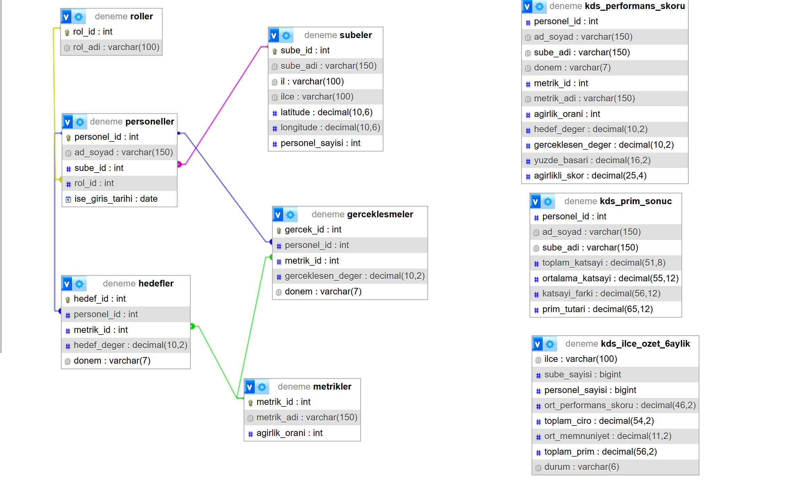

# Prim KDS REST API (MVC)

**Ders:** Sunucu Tabanlı Programlama  
**Konu:** MVC Mimarisi ile RESTful API Tasarımı  
**Geliştirme Dili/Çatısı:** Node.js (Express)  
**Teslim Türü:** Bireysel  

---

## GitHub Repository (Public)

Proje GitHub üzerinde **public** olarak paylaşılmıştır.

🔗 Repository Linki:  
https://github.com/senaatasci/prim-kds-api

---

## Proje Açıklaması

Bu proje, perakende sektöründe faaliyet gösteren bir zincirin
şube ve personel performanslarının izlenmesi ve analiz edilmesi amacıyla
geliştirilmiş bir **RESTful API** uygulamasıdır.

Uygulama; veriye dayalı karar destek sistemlerini temel alarak,
harita, ilçe detay, personel analiz ve yönetimsel öneri ekranlarını
besleyen servisleri sunar.

Proje **katı biçimde MVC mimarisine uygun** olarak tasarlanmıştır.

---

## MVC Mimarisi

Proje aşağıdaki katmanlara ayrılmıştır:

- **routers/** → REST API endpoint tanımları  
- **controllers/** → İş mantığı ve veri işleme katmanı  
- **db/** → Veritabanı bağlantısı ve sorgular (Model)  
- **views/** → HTML tabanlı arayüzler (View)  
- **public/** → Statik dosyalar (CSS / JS / images)

Bu yapı sayesinde kod okunabilirliği, sürdürülebilirlik ve
ölçeklenebilirlik sağlanmıştır.

---

## Senaryo Tanımı

Perakende zincirinde şube ve personel bazlı performans metrikleri
(ciro, müşteri memnuniyeti vb.) düzenli olarak takip edilmektedir ve bunlar üzerinden her personelin prim tutarları hessaplanmaktadır.

Bu sistem:

- İl bazlı ve ilçe bazlı performans analizleri yapar
- Harita üzerinden görsel analiz imkânı sunar
- Personel performanslarını detaylı şekilde inceler
- Yönetim için otomatik öneriler üretir

Tüm bu veriler **REST API** aracılığıyla istemci katmanına sunulur.

---

## İş Kuralları ve Özel Senaryolar

Projede en az iki adet iş kuralı içeren senaryo uygulanmıştır:

1. **Yetkilendirme Senaryosu**  
   Kimlik doğrulaması yapılmadan belirli API uç noktalarına erişim
   engellenmektedir.

2. **Veri Kontrol Senaryosu**  
   Performans verisi bulunmayan ilçe veya personel için sistem,
   hataya düşmeden kontrollü ve bilgilendirici yanıt üretmektedir.

---

## Kullanılan Teknolojiler

- Node.js
- Express.js
- MySQL (mysql2)
- dotenv
- nodemon (geliştirme ortamı)

---

## Kurulum Adımları

### 1) Projeyi klonla
```bash
git clone https://github.com/senaatasci/prim-kds-api.git
cd prim-kds-api

## ER Diyagramı

Aşağıda projenin veritabanı yapısını gösteren ER diyagramı yer almaktadır:



